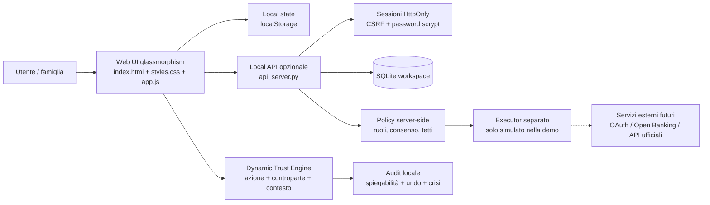

# Architecture Diagram

## Componenti

- **Web UI**: dashboard statica senza dipendenze, onboarding, domini, governance e simulazione delle decisioni.
- **Dynamic Trust Engine**: assegna un punteggio 0–100 a ogni combinazione di azione, controparte e contesto; il punteggio decade e apprende da approvazioni, rifiuti e correzioni.
- **Policy layer**: applica consenso per dominio, tetti economici, permessi familiari, modalità “chiedimi sempre” e confini per salute/documenti legali.
- **Audit**: registra spiegazioni, eventi e correzioni in modo verificabile; la demo non esegue pagamenti o prenotazioni reali.
- **Local API**: opzionale; gestisce account, sessioni, CSRF, workspace SQLite e sincronizzazione dello stato.
- **Executor**: volutamente separato dal modello e non collegato a servizi esterni in questa submission.

## Flusso di una decisione

1. La UI riceve una richiesta.
2. Il motore normalizza azione, controparte e contesto.
3. La policy controlla sensibilità, consenso, ruolo e tetti.
4. Il sistema decide se eseguire localmente, inserire nel digest o chiedere conferma.
5. L'evento viene spiegato e registrato nell'audit.
6. L'interazione aggiorna il profilo di fiducia specifico.
