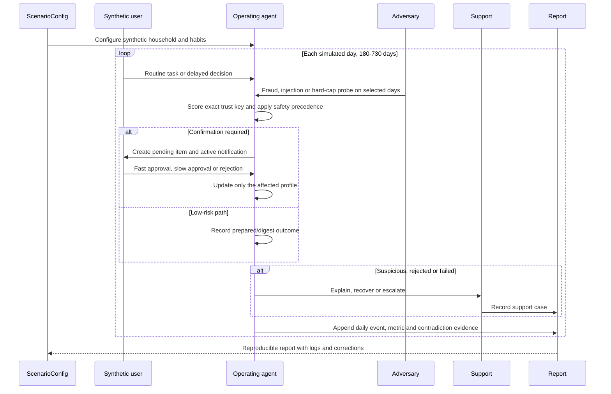
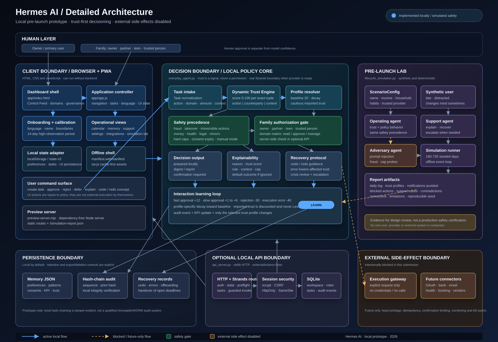

# Hermes AI Architecture

This document describes the architecture of the local pre-launch prototype. It is deliberately explicit about what is implemented, what is simulated, and where real-world side effects are blocked. The companion visual is **architecture diagram v3**: a 2200×1450 SVG organized by trust boundaries, execution status and data flow.

## System boundary

```mermaid
flowchart TB
  %% Human entry points
  subgraph HUMAN[Human layer]
    OWNER[Owner / primary user]
    FAMILY[Family members\nowner, partner, teen, trusted person]
  end

  %% Browser and presentation
  subgraph CLIENT[Client boundary: browser or installed PWA]
    ENTRY[Root entry point\nindex.html -> app/]
    UI[Ops Analytics dashboard\napp/index.html + app/app.js]
    VIEWS[Views\nControl Feed · Calendar · Domains\nMemory · Support · Governance · Settings]
    ONBOARD[Onboarding\nlanguage · name · boundaries\n14-day calibration notice]
    COMMANDS[User commands\ncreate task · approve · reject\ndefer · explain · undo concept]
    STATE[Local state adapter\nlocalStorage\nstate-v2]
    OFFLINE[Service worker\napp/sw.js\ncache-first shell / offline UI]
  end

  %% Local decision system
  subgraph DECISION[Decision boundary: local policy engine]
    INTAKE[Task normalization\naction · category · amount\nreversibility · urgency · provider]
    TRUST[Dynamic Trust Engine\n0-100 per action|counterparty|context]
    PROFILE[(Trust profiles\nscore · outcomes · latency\nlast interaction · decay)]
    IMPORT[Similar-domain import\ndiscounted proposal\nnever Level 1 by default]
    POLICY[Policy gate / precedence\nfraud · hard caps · sensitive data\nconsent · family role · manual mode\nDND · urgency · reversibility]
    STRANDS[Real Strands Agent when ready\nBedrock or Ollama provider\nno credentials in tools / no effects]
    PROVIDER[Provider readiness\nSDK + model + privacy opt-in\nready / unavailable / error]
    TOOLS[Guarded tools\nnormalize · trust lookup\npolicy · explain · local draft]
    CLASSIFY[Decision output\nprepared · digest · confirmation]
    EXPLAIN[Explainability\nrule applied · trust score\ncontext · default outcome]
    RECOVERY[Recovery controls\nundo / redo concept\nrollback guidance · crisis mode]
    LEARN[Interaction update\nfast approval +12\nslow approval +1 to +6\nrejection -30 · error -40]
  end

  %% Persistence and optional backend
  subgraph STORAGE[Persistence boundary]
    MEMORY[(Memory JSON\npreferences · patterns\nconsents · routing · KPI)]
    AUDIT[Local hash-chain audit\nsequence · previous hash\nexplainable event history]
    BROWSERDB[(Browser local storage\nprototype persistence)]
  end

  subgraph API[Optional local API boundary]
    HTTP[api_server.py\nstdlib HTTP server]
    SESSION[Session security\nHttpOnly cookie · SameSite Strict\nCSRF token · scrypt password hash]
    AUTHZ[Server authorization\nowner / partner / teen / trusted person\npermission matrix]
    SQLITE[(SQLite workspace\nusers · workspaces · memberships\nsessions · permissions · tasks\nexecution requests · audit events)]
    VERSION[Optimistic state versioning\nconflict detection]
  end

  %% Side systems
  subgraph LAB[Pre-launch Lab: offline and synthetic]
    SYNTH[Scenario configuration\nname · income · household\nhabits · trusted provider]
    USER_AGENT[Synthetic user agent\ndistracted · late · changes mind]
    OPS_AGENT[Operating agent\ntrust-first policy behavior]
    SUPPORT[Support agent\nexplanation · recovery\nescalation when needed]
    ADVERSARY[Adversarial agent\nprompt injection · fraud\nhard-cap probes]
    SIM[LifecycleSimulation\n180-730 deterministic days\nseeded reproducible log]
    REPORT[Report artifacts\ndaily log · metrics\ncontradictions · corrections]
  end

  %% Executor and external future boundary
  subgraph EFFECTS[External side-effect boundary: disabled in this submission]
    GATEWAY[Execution gateway\nreceives explicit request\nno provider credentials]
    BLOCK[Safety response\nprepared or blocked\nexternalAction=false]
    CONNECTORS[Future scoped connectors\nOAuth · Open Banking\ncalendar · email · health · booking\nsmart home · vendors]
    PROVIDERS[(Third-party services\nnot contacted by the prototype)]
  end

  OWNER --> ENTRY
  FAMILY --> UI
  ENTRY --> UI
  UI --> VIEWS
  UI --> ONBOARD
  ONBOARD --> STATE
  VIEWS --> COMMANDS
  COMMANDS --> INTAKE
  UI --> STATE
  OFFLINE --> UI
  STATE --> BROWSERDB

  INTAKE --> TRUST
  TRUST --> PROFILE
  TRUST --> IMPORT
  IMPORT -. cautious proposal .-> POLICY
  PROFILE --> POLICY
  COMMANDS --> POLICY
  POLICY --> CLASSIFY
  POLICY -. mandatory preflight .-> STRANDS
  STRANDS --> PROVIDER
  STRANDS --> TOOLS
  TOOLS --> CLASSIFY
  CLASSIFY --> EXPLAIN
  CLASSIFY --> RECOVERY
  CLASSIFY --> GATEWAY
  CLASSIFY --> AUDIT
  EXPLAIN --> UI
  RECOVERY --> UI
  GATEWAY --> BLOCK
  GATEWAY -. future only .-> CONNECTORS
  CONNECTORS -. future only .-> PROVIDERS
  BLOCK --> AUDIT
  COMMANDS --> LEARN
  LEARN --> PROFILE
  LEARN --> MEMORY
  AUDIT --> MEMORY
  MEMORY --> STATE

  UI -. authenticated mode .-> HTTP
  HTTP --> SESSION
  SESSION --> AUTHZ
  AUTHZ --> SQLITE
  HTTP --> VERSION
  VERSION --> SQLITE
  HTTP --> POLICY
  HTTP --> AUDIT
  HTTP --> GATEWAY

  SYNTH --> SIM
  USER_AGENT --> SIM
  OPS_AGENT --> SIM
  SUPPORT --> SIM
  ADVERSARY --> SIM
  SIM --> REPORT
  REPORT -. synthetic evidence only .-> POLICY
  REPORT -. synthetic trust interactions .-> PROFILE
```

## Visual architecture diagram v3

The standalone SVG is designed for both technical review and hackathon presentation. It separates six boundaries so a reviewer can follow the system without inferring hidden capabilities:

1. **Human and input layer** — users, family roles, commands and untrusted content.
2. **Client boundary** — PWA shell, onboarding/calibration, offline state, command adapter and the two Strands controls.
3. **Orchestration and trust decision** — the mandatory deterministic preflight, exact trust lookup, policy gate, provider readiness and guarded Strands tools.
4. **Control, authorization and data** — safety precedence, family permission matrix, execution gateway, memory, audit and optional local API.
5. **Pre-launch multi-agent lab** — synthetic user, operating agent, support agent, adversary agent, seeded runner and report artifacts.
6. **Delivery modes and future integrations** — public demo, local backend, real provider setup and connectors that remain disabled.

The legend is intentional: blue means an active local flow, green means a safety or authorization gate, violet means optional Strands/simulation evidence, and amber means blocked or future-only. The diagram also repeats `externalAction = false` at the side-effect boundary so the prototype’s limitation is visible rather than implied.

## Component map

| Boundary | Component | Source | Responsibility | Status |
|---|---|---|---|---|
| Client | Dashboard shell | `app/index.html`, `app/styles.css`, `app/ops-overrides.css` | Dark, data-dense operational interface | Implemented locally |
| Client | Application state | `app/app.js` | Navigation, onboarding, task flows, local persistence and UI rendering | Implemented locally |
| Client | Governance Strands trace | `app/index.html`, `app/app.js`, `app/ops-overrides.css` | Visible preflight, provider readiness, real-invocation result and privacy-safe tool lifecycle; `externalAction=false` proof | Implemented locally |
| Decision | Task intake | `everyday_agent.py: Task` and `EverydayAgent` | Normalize the request and its risk signals | Implemented locally |
| Decision | Dynamic Trust Engine | `everyday_agent.py: DynamicTrustEngine` | Score each action/counterparty/context tuple; decay and cautious import | Implemented and tested |
| Decision | Strands orchestration boundary | `strands_orchestrator.py` | Run a real Strands Agent with Bedrock/Ollama when ready; record privacy-safe tool lifecycle; never cross external effect boundary | Implemented with explicit provider readiness states |
| Persistence | Memory | `everyday_agent.py: Memory` | Preferences, patterns, trust profiles, consent, KPI and recovery history | Implemented locally |
| Persistence | Audit | `Memory.record_audit()` and `api_server.py: append_audit()` | Hash-linked explanation and event history | Local prototype implementation |
| Backend | Optional API | `api_server.py` | Local auth, workspace state, tasks and authorization | Implemented locally; development only |
| Backend | SQLite repository | `api_server.py: Database` | Store accounts, workspace, sessions, permissions, tasks and audit events | Implemented locally |
| Effects | Execution gateway | `api_server.py: request_execution()` | Explicit boundary for side effects; blocks unconfigured/sensitive operations | Implemented as a blocking stub |
| Lab | Lifecycle simulation | `lifecycle_simulation.py` | Run a deterministic six-to-twenty-four-month synthetic lifecycle | Implemented and tested |
| Lab | Role simulation | `UserAgent`, `SimulationAgent`, `SupportAgent`, `AdversaryAgent` | Exercise fallibility, support and attack scenarios | Implemented and tested |
| Delivery | Preview server | `preview-server.mjs` | Dependency-free static server and simulation endpoint | Implemented locally |

Line references may move as the prototype evolves; class and file names are the stable mapping.

## Request lifecycle

1. **Capture:** the user enters a request in the dashboard or an authenticated client sends it to the optional local API.
2. **Normalize:** the request becomes a `Task` containing action, category, counterparty, context, amount, reversibility, urgency and suspicious signals.
3. **Resolve trust:** `DynamicTrustEngine` builds the exact key `action|counterparty|context`. A new key starts at `20/100`. A related profile can provide a discounted proposal, but imported trust is never allowed to silently execute.
4. **Apply policy:** the policy gate evaluates safety signals before convenience. Sensitive domains, suspicious activity, irreversible actions, missing consent, role restrictions, manual mode and hard caps can force confirmation or a block.
5. **Classify:** the prototype exposes the familiar Level 1/2/3 output for compatibility with existing UI, but the score and policy gate determine the result. The output is a local preparation, a digest item or a confirmation request.
6. **Explain:** the decision stores its reason, trust score, trust key, context, cap and possible default outcome. The user can request an explanation without recreating the original task.
7. **Protect effects:** any execution request crosses the gateway. The current gateway has no external credentials or active connectors, so no payment, email, booking, deletion or health-system operation is sent.
8. **Record:** the event is written to local memory and the hash-linked audit history. The optional API writes the equivalent workspace event to SQLite.
9. **Learn:** only the relevant trust profile is updated. Fast approvals increase confidence, delayed approvals increase it less, rejection reduces it sharply and execution errors reduce the affected combination while opening crisis handling.
10. **Recover:** supported local flows expose undo/redo concepts and rollback guidance. Irreversible external actions remain subject to provider-specific recovery and human review.
11. **Orchestrate safely:** the deterministic preflight runs first. If the SDK and selected provider are ready, Strands runs a real `Agent` with guarded read-only/local-draft tools and a callback recorder that retains only lifecycle labels and tool names. It cannot override the policy result, infer consent or trigger an external connector. If readiness fails, Hermes returns an explicit `sdk-unavailable`, `provider-unavailable` or `provider-error` result instead of pretending that a model ran.

## Strands orchestration boundary

The Governance view mirrors this boundary for the reviewer: **normalize request → lookup exact trust → apply authoritative policy → human control → external side-effect boundary**. It can call the authenticated local API for the preflight or the real provider invocation. The browser can show only a clearly labelled unavailable state; it never fabricates tool calls or a live model response. The trace is evidence of the control flow, not a claim that a real payment, booking or message was executed.

`strands_orchestrator.py` follows the Strands Agents Python pattern (`from strands import Agent, tool`) and supports the documented `BedrockModel` and `OllamaModel` providers. `provider_status()` checks SDK/provider readiness without returning secrets; `build_agent()` creates the actual Strands Agent; `StrandsTraceRecorder` captures callback events and guarded tool lifecycle. The sequence is fixed: normalize → exact trust lookup → policy gate → human-control explanation → local draft boundary. The SDK is never granted payment, email, calendar, health or shell tools. No model response can turn `externalAction` into `true`.

The package is listed separately in `requirements-strands.txt` so the public Railway/static prototype remains dependency-free. For a real invocation, select `ollama` for a local model or `bedrock` with the explicit `HERMES_STRANDS_ALLOW_CLOUD=true` opt-in. Bedrock additionally requires AWS model access, IAM permissions, provider configuration, monitoring and a separate security review. The UI reports readiness honestly; it never treats the browser preflight as a live model call.


The core profile is scoped to a precise tuple:

```text
trust_key = normalized_action | normalized_counterparty | normalized_context
```

The prototype uses these guardrails:

- baseline: `20/100` for an unseen combination;
- fast approval: positive update, currently up to `+12`;
- slow approval: smaller update, from `+1` to `+6` depending on delay;
- rejection: `-30` for the affected key;
- execution error: `-40` for the affected key;
- decay: the distance from baseline halves over the configured half-life;
- imported trust: discounted, explicit proposal, never Level 1 by default;
- sensitive caps: money, health and legal/document domains remain below autonomous bands;
- dynamic spending limit: calculated only for non-sensitive combinations and still subject to hard transaction/monthly controls.

Trust is a behavioral signal, not a permission. Consent, role authorization and safety policy remain independent checks.

## Security and responsibility precedence

When rules conflict, the order is:

1. Suspicious activity, fraud and account-takeover signals
2. Absolute caps and irreversible-action protection
3. Sensitive data and domains: money, health, legal documents and minors
4. Explicit consent, expiry and revocation
5. Family role and permission matrix
6. Manual mode and user-selected notification controls
7. Urgency, Do Not Disturb and digest routing
8. Dynamic trust score
9. Convenience and automation depth

External email or document content is untrusted input. It can describe a task, but it cannot grant consent, change the permission matrix or override the policy gate.

## Optional API data path

The browser demo can operate without the backend. When the optional backend is used:

```text
Browser -> session endpoint -> HttpOnly session cookie + CSRF token
Browser -> authenticated state/task request
      -> API handler
      -> server-side role and permission check
      -> EverydayAgent with workspace-backed Memory callback
      -> SQLite transaction
      -> hash-linked audit event
```

The API currently provides local development routes for health, session, state, permissions, members, tasks, task approval/rejection/defer, consent, execution requests, Strands status/preflight/invocation and audit inspection. `/api/strands/status` reports provider readiness; `/api/strands/invoke` invokes the real provider only when ready and returns tool lifecycle metadata. The server intentionally reports `externalActions: false`.

Production gaps are documented rather than hidden: TLS termination, managed secrets, rate limiting, encrypted backups, key rotation, immutable audit storage, provider contracts, connector isolation, monitoring, incident response and a legal/privacy review are still required.

## Simulation architecture

`lifecycle_simulation.py` is an offline test laboratory, not a production multi-agent runtime:



The report contains daily events, notification volume, calibration noise, support cases, blocked actions, adversarial events, trust profiles, contradictions and proposed rule corrections. It uses synthetic data and a seeded random generator; its results are evidence for design review, not a safety certification.

## Deployment modes

| Mode | Entry point | Data location | External effects |
|---|---|---|---|
| Static browser demo | `node preview-server.mjs` | Browser local storage | None |
| Optional local backend | `python api_server.py --serve-static` | Local SQLite + workspace JSON | None |
| Pre-launch lab | `python lifecycle_simulation.py --days 365 --seed 20260831` | JSON report | None |
| Future production system | Not included | Managed, encrypted services | Only through separately reviewed scoped connectors |

## Non-goals of this submission

The prototype does not claim to be a bank, healthcare application, legal service, email sender, booking service, smart-home controller, insurance product or autonomous payment system. Integrations shown in the UI are product concepts and local simulations. A real deployment must add provider-specific consent, least-privilege credentials, idempotency, confirmation binding, failure handling, user-visible receipts, data retention controls and an emergency kill switch.

## Related documents

- [README](README.md) — product overview and run instructions
- [SUBMISSION](SUBMISSION.md) — hackathon description and demo script
- [MASTER_POLICY](MASTER_POLICY.md) — operating and safety policy
- [PRELAUNCH_SIMULATION](PRELAUNCH_SIMULATION.md) — simulation methodology
- [LEGAL_COMPLIANCE_BASELINE](LEGAL_COMPLIANCE_BASELINE.md) — pre-launch legal and privacy baseline


