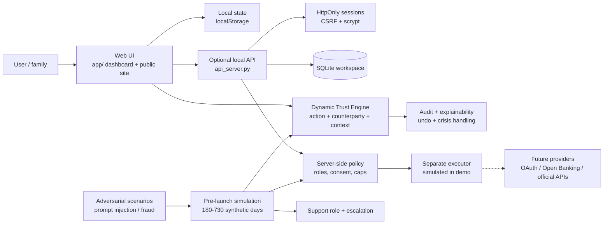

# Architecture Diagram

## Components

- **Web UI:** dependency-free dashboard with onboarding, language selection, Control Feed, calendar, time tracking, support, governance and PWA assets.
- **Dynamic Trust Engine:** maintains a continuous 0–100 profile for each exact action/counterparty/context combination. It learns from interaction speed and outcome, decays over time and keeps imported trust cautious.
- **Policy layer:** evaluates sensitive domains, explicit consent, family roles, manual mode, urgency, reversibility, suspicious activity and absolute spending caps before autonomy can be granted.
- **Audit layer:** records the applied rule, trust profile, decision, timestamp and corrections. The browser demo uses a local tamper-evident hash chain; it is not an immutable production audit system.
- **Optional local API:** demonstrates sessions, CSRF, password derivation, SQLite persistence and server-side authorization. It does not call external providers.
- **Executor boundary:** deliberately separated from the model and disabled for real-world side effects in this submission. Future connectors must add OAuth, least privilege, idempotency, confirmation binding, monitoring and a kill switch.
- **Pre-launch laboratory:** deterministic, offline simulation with four roles: synthetic user, operational agent, Support and adversary. It produces daily logs, metrics, contradiction findings and policy corrections without mutating real user state.

## Decision flow

1. The UI receives a request.
2. The trust engine normalizes action, counterparty and context.
3. The policy gate checks safety precedence, consent, role, caps, urgency and reversibility.
4. The system chooses a local action, digest item or confirmation request.
5. The decision is explained and written to the local audit trail.
6. The user outcome updates only the relevant trust profile.

## Security precedence

1. Fraud, account takeover and high-impact signals
2. Absolute caps and irreversible-action protection
3. Sensitive data, health, money, legal documents and minors
4. External content is treated as untrusted input and cannot authorize an action
5. Do Not Disturb and notification policy
6. Dynamic trust score

The security boundary always wins over convenience or a high trust score. The simulation verifies this precedence against adversarial events, but simulation results are test evidence rather than a guarantee of production safety.
